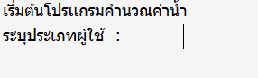
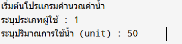
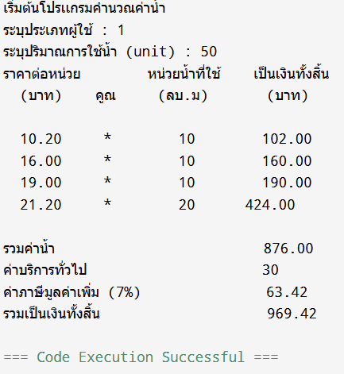

# Mini-Project-Calculate-Water
โปรเเกรมคำนวนค่าน้ำ

## หน้าเลือกปะปาที่ใช้บริการ
โดยจะมีอยู่ 3 เเบบก็คือ 1.เเบบทั่วไป 2.กปภ.สาขาภูเก็ต เกาะสมุย เเละเกาะพังงา 3.เอกชนร่วมลงทุนเเละพื้นที่จังหวัดชลบุรี

## ใส่หน่วยลูกบาศก์เมตร
ใส่หน่วยลูกบาศก์เมตรที่เราใช้น้ำไป

## ผลลัพธ์ในการคำนวณ
เเสดงผลลัพธ์ทุกอย่างในการคำนวน

